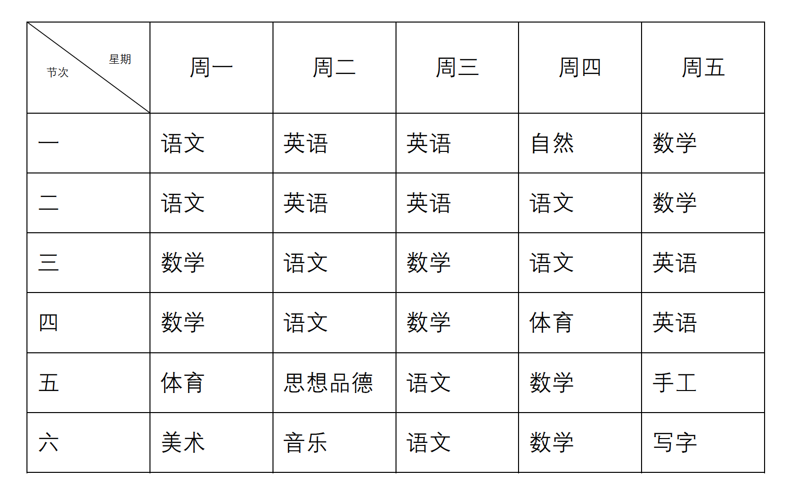
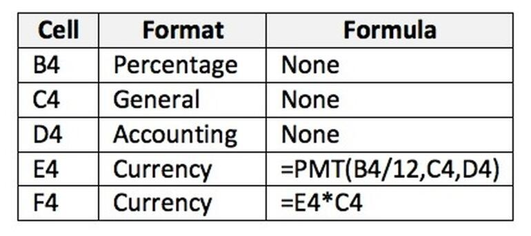

                                ━━━━━━━━━━━━━━━━━━━━━━━━━━━━━━━━━━━━━━━━━━━━━━━━━━━━━━━━━━━━━━━━━
                                     TABLE DETECTION IN IMAGES AND OCR TO CSV WITH JAVA
                
                                                    Yan Shi
                                ━━━━━━━━━━━━━━━━━━━━━━━━━━━━━━━━━━━━━━━━━━━━━━━━━━━━━━━━━━━━━━━━━

# Guide
1.  [Overview](#Overview)
2.  [Requirements](#Requirements)
3.  [Demo](#Demo)
4.  [Modules](#Modules)
5.  [Contact](#Contact)
6.  [Reference](#Reference)

# Overview

This java package contains modules to help with finding and extracting tabular
data from a PDF or image into a CSV format.

Given an image that contains a table&#x2026;

 

  

 

Extract the the text into a CSV format&#x2026;

    节次 星期,周—,周二,周三,周四,周五
    一,语文,英语,英语,自然,数学
    二,语文,英语,英语,语文,数学
    三,数学,语文,数学,语文,英语
    四,数学,语文,数学,体育,英语
    五,体育,思想品德,语文,数学,手工
    六,美术,音乐,语文,数学,写字

# Requirements

See maven dependency jar package.

-   `pdfbox` 2.0.26
-   `javacv` 1.5.7 
-   `djl` 0.17.0
-   ...

# Demo

There is a demo module that will try to extract tables from the image and process the cells into a CSV. You can try it out with one of the images included in this repo.

1.table/demo/MainDemo
    
That will run against the following image:

  

  

 

The following should be saved to your directory after running the class table/demo/MainDemo.java.

    Extracted the following tables from the image:
    [('/img_test/simple.png', ['/img_test/simple/table-0.png'])]
    Extracted cells from /img_test/simple/table-0.png
    Cells:
    /img_test/simple/table-0/0-0.png
    /img_test/simple/table-0/0-1.png
    /img_test/simple/table-0/0-2.png
    ...
    
    Here is the entire CSV output:
    
    Cell,Format,Formula
    B4,Percentage,None
    C4,General,None
    D4,Accounting,None
    E4,Currency,"=PMT(B4/12,C4,D4)"
    F4,Currency,=E4*C4

# Modules

The package is split into modules with narrow focuses.

-   `pdf_to_images` uses pdfbox to extract images from a PDF.
-   `extract_tables` finds and extracts table-looking things from an image.
-   `extract_tables_dnn` finds and extracts table-looking things from an image by deep learning model.
-   `extract_cells` extracts and orders cells from a table.
-   `ocr_image` uses djl to OCR the text from an image of a cell.
-   `ocr_to_csv` converts into a CSV the directory structure that `ocr_image` outputs.

The outputs of a previous module can be used by a subsequent module so that they
can be chained together to create the entire workflow.

# Contact

1、github：https://github.com/jiangnanboy

2、QQ:2229029156

3、Email:2229029156@qq.com

# Reference

https://github.com/jiangnanboy/doc_ai

https://github.com/deepjavalibrary/djl

https://github.com/jiangnanboy/java-springboot-paddleocr

